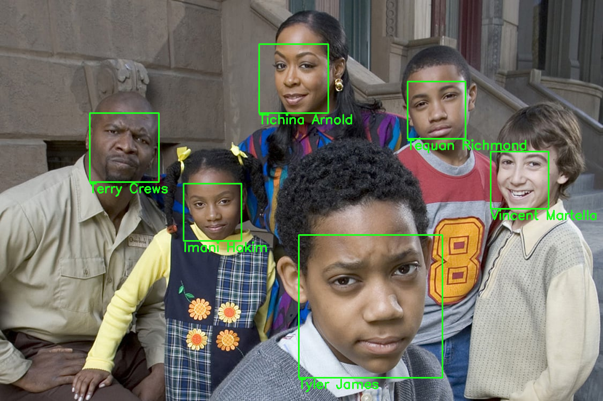

# Criando um Sistema de Reconhecimento Facial do Zero

O objetivo desse projeto foi desenvolver um código para detectar e identificar rostos.

É um código simples que funcionou utilizando apenas uma foto de cada pessoa como referência, porém é possível adicionar mais fotos caso seja necessário.

## Resultado

